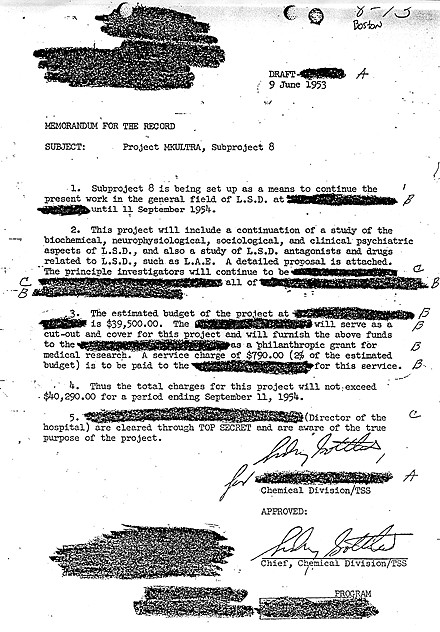

# classified

`Redact` or `Sanitize` your classified Go strings.

The above sentence would look like `██████ ██ ████████ ████ ██████████ ██ ███████` when sanitized and `[REDACTED] [REDACTED] [REDACTED] [REDACTED] [REDACTED] [REDACTED] [REDACTED]` when redacted.

## Usage
Install the package with `go get github.com/Sayan98/classified`

```go
package main


import (
    "github.com/Sayan98/classified"
    "fmt"
)


func main() {
    myStr := "My secret string!"

    fmt.Println("original  : ", myStr)
    fmt.Println("redacted  : ", classified.Redact(myStr))
    fmt.Println("sanitized : ", classified.Sanitize(myStr))
}
```

## What is Sanitization and Redaction ?

>**Sanitization** is the process of removing sensitive information from a document or other message (or sometimes encrypting it), so that the document may be distributed to a broader audience. When the intent is secrecy protection, such as in dealing with classified information, sanitization attempts to reduce the document's classification level, possibly yielding an unclassified document. When the intent is privacy protection, it is often called data anonymization. Originally, the term sanitization was applied to printed documents; it has since been extended to apply to computer media and the problem of data remanence as well.

>**Redaction** in its sanitization sense (as distinguished from its other editing sense) is the blacking out or deletion of text in a document, or the result of such an effort. It is intended to allow the selective disclosure of information in a document while keeping other parts of the document secret. Typically the result is a document that is suitable for publication or for dissemination to others than the intended audience of the original document. For example, when a document is subpoenaed in a court case, information not specifically relevant to the case at hand is often redacted.



## Author
Sayan Goswami


